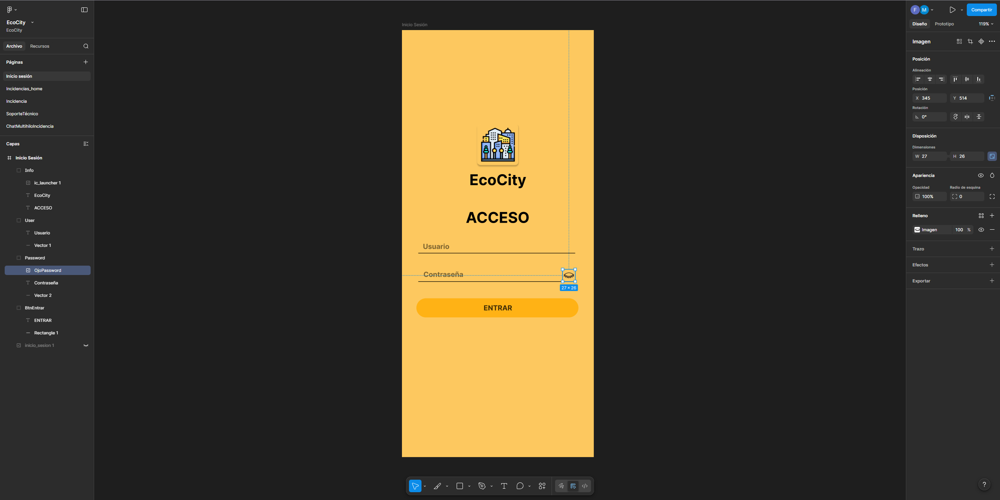
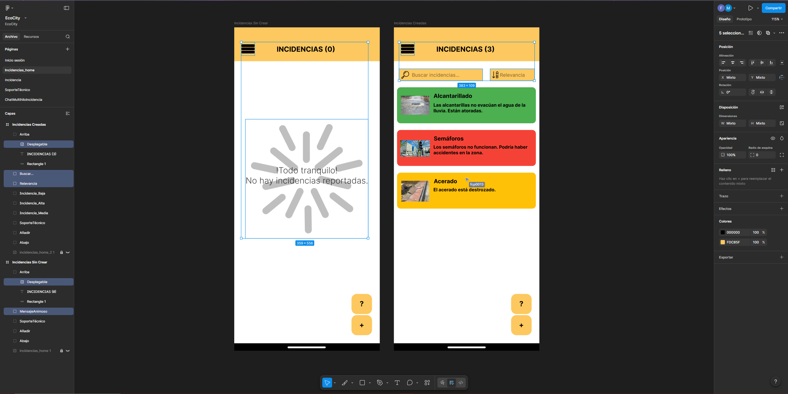
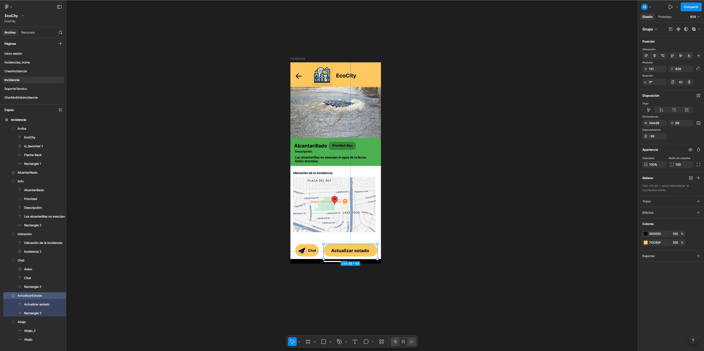
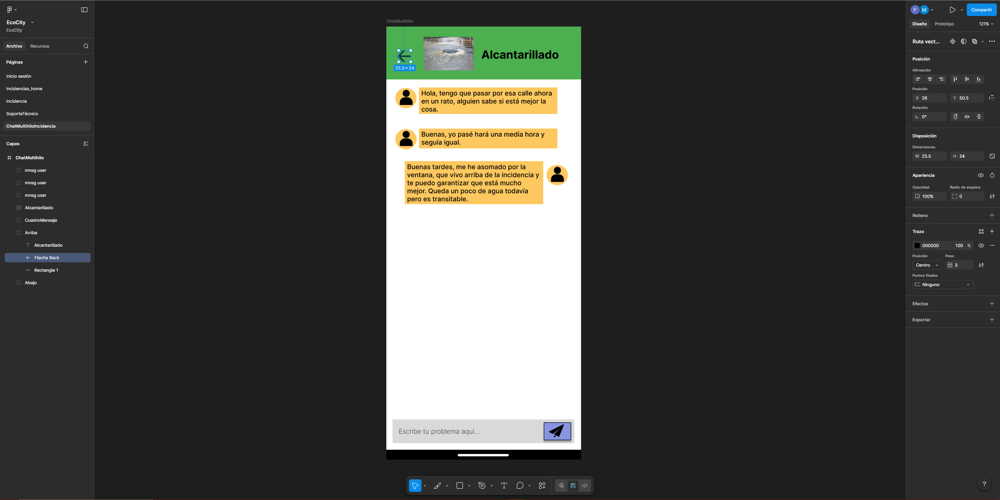
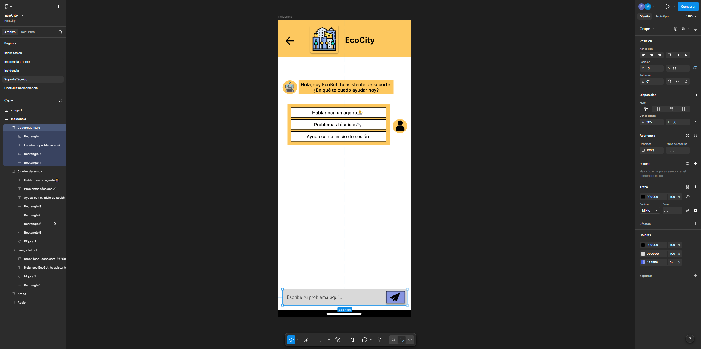

# EcoCity - Gestión de Incidencias Urbanas

**EcoCity** es una solución móvil diseñada para fortalecer el vínculo entre los ciudadanos y su ayuntamiento. A través de una interfaz intuitiva basada en **Material Design**, permite reportar, gestionar y hacer seguimiento de incidencias en la vía pública de forma eficiente.

Este proyecto ha sido desarrollado para el módulo de **Desarrollo de Interfaces** (2º DAM).

---

## Autores
* **Félix Caballero Peña**
* **Miguel Ceballos Sánchez**

---

## Enlaces del Proyecto
* **Prototipo en Figma:** [Acceder al Prototipo Interactuable](https://www.figma.com/proto/zEWyhfruel0aKNhgebbJvt/EcoCity?node-id=0-1&t=6MdDGFAevaeLi9t6-1)
* **Presentación en Canva:** [Ver Presentación del Proyecto](https://github.com/mcs0056/EcoCity_Documentacion/blob/main/Canva-EcoCity.pdf))

---

## Descripción del Proyecto
EcoCity permite a los usuarios:
- **Reportar incidencias** con descripción, ubicación y archivos multimedia.
- **Visualizar estados** en tiempo real (Pendiente, En Proceso, Resuelta).
- **Comunicación directa** mediante un chat de soporte integrado.
- **Filtrado inteligente** para localizar avisos previos de forma rápida.

### Fundamentos de Diseño
- **Material Design:** Uso de componentes oficiales (FAB, Cards, TextFields).
- **Tipografía:** Inter (legible y jerarquizada).
- **Accesibilidad:** Contraste optimizado y feedback visual constante.

---

## Proceso de Diseño e Iteración (v1 -> v2)

Tras realizar pruebas de usabilidad con 5 usuarios externos, identificamos puntos de fricción críticos que fueron resueltos en la versión final:

| Problema Detectado (v1) | Mejora Implementada (v2) | Impacto |
| :--- | :--- | :--- |
| Inseguridad al escribir la contraseña | Botón de visibilidad (ojo) en Login | Seguridad y reducción de errores |
| Confusión ante listas vacías | Pantalla de estado vacío con ilustración/texto | Feedback comunicativo |
| Dificultad para localizar incidencias | Sistema de búsqueda y filtros | Eficiencia y ahorro de tiempo |
| Imposibilidad de retroceder en el chat | Botón de navegación "Atrás" | Control y libertad del usuario |
| Falta de control sobre el progreso | Botón de actualización de estado manual | Transparencia en la gestión |

---

## Estructura del Repositorio
El repositorio está organizado de la siguiente manera:

* `/figma`: Enlaces al archivo de diseño y prototipos v1 y v2.
* `/documentacion`: Documentación GUI detallada en formato PDF.
* `/pruebas_usabilidad`: Plan de pruebas, metodología y análisis de resultados.
* `/imagenes`: Capturas de pantalla.

---

## Herramientas Utilizadas
- **Figma:** Diseño de interfaz y prototipado de alta fidelidad.
- **Canva:** Presentación visual del proyecto.
- **GitHub:** Control de versiones y alojamiento de documentación.
- **Material Design 3:** Guía de estilos y componentes.

---

## Galería de Capturas: Evolución del Diseño (v1 vs v2)

A continuación se presentan las capturas de pantalla de la aplicación. En la columna de la izquierda se muestra el diseño inicial (v1) y en la derecha el rediseño final (v2) con las mejoras de usabilidad aplicadas.

| Pantalla | Prototipo v1 (Original) | Prototipo v2 (Mejorado) |
| :--- | :---: | :---: |
| **Login** (Visibilidad password) | ![v1]..
 |  |
| **Menú Principal** (Filtros y búsqueda) | ![v1]..
|  |
| **Detalle Incidencia** (Control de estado) | ![v1]
 |  |
| **Chat** (Navegación y salida) | ![v1]
 |  |
| **Soporte** (Ajustes visuales) | ![v1]
 |  |

---
